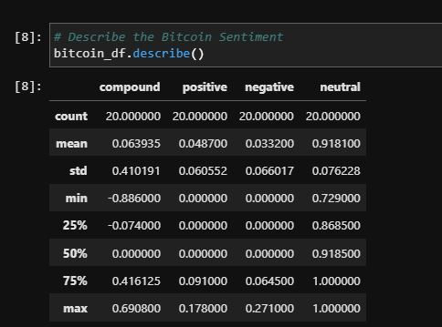
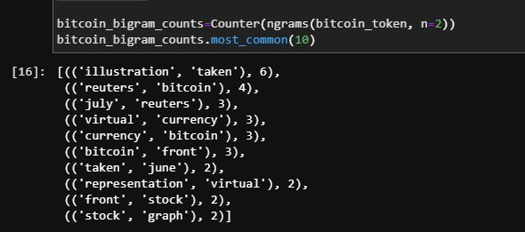

# Natural Language Processing 

This notebook uses Sentiment Analysis to perform a comparative analysis between the sentiment in the news about Bitcoin and Ethereum.  It gives each currency a compound score based on compound, positive, negative, and neutral news. 

The second part uses a tokenizer function to pull out the 10 most popular words from the content of all the articles and displays these most popular words in a wordcloud. This essentially breaks down sentence into invidual words that can analyzed. 

The third part uses natural entity recognition to separate words out by their part of speech.  

## Technologies
This use project uses Python 3.8 and iPython in Jupyter Lab.  Windows 10 is the operating system.

## Libraries Uses
    Pandas - used to create dataframes and manipulate data in dataframes
    Numpy - used to perform calculations on data
    Pathlib - path library used to set filepath
    collections - uses Counter to count data
    os-used to access env files from local machine
    dotenv-accesses files on local machine
    NewsApiClient-api to fetch news articles and headlines
    nltk-natural language processor that helps slice articles for analysis
    re-regular expression to help remove all non-alphanumeric characters from articles
    collections-used Counter function to count ngrams
    WordCloud-used to display words based on frequency of use
    matplotlib-used for graphic display
    Spacy- used for Named Entity Extraction

## Installation Guide
This requires the latest version of Anaconda, WordCloud, and Spacy. 

## Examples

 
 

## Usage

This can modiefied to compare subjects other than Bithcoin and Ethereum.  By changing the q-values in the get_headlines function, and run the analysis on a keyword of your choice.  

## Contributors
Ryan Dibeler

ryandibeler@gmail.com

## License
MIT License

Copyright (c) [2021] [Ryan Dibeler]

Permission is hereby granted, free of charge, to any person obtaining a copy
of this software and associated documentation files (the "Software"), to deal
in the Software without restriction, including without limitation the rights
to use, copy, modify, merge, publish, distribute, sublicense, and/or sell
copies of the Software, and to permit persons to whom the Software is
furnished to do so, subject to the following conditions:

The above copyright notice and this permission notice shall be included in all
copies or substantial portions of the Software.

THE SOFTWARE IS PROVIDED "AS IS", WITHOUT WARRANTY OF ANY KIND, EXPRESS OR
IMPLIED, INCLUDING BUT NOT LIMITED TO THE WARRANTIES OF MERCHANTABILITY,
FITNESS FOR A PARTICULAR PURPOSE AND NONINFRINGEMENT. IN NO EVENT SHALL THE
AUTHORS OR COPYRIGHT HOLDERS BE LIABLE FOR ANY CLAIM, DAMAGES OR OTHER
LIABILITY, WHETHER IN AN ACTION OF CONTRACT, TORT OR OTHERWISE, ARISING FROM,
OUT OF OR IN CONNECTION WITH THE SOFTWARE OR THE USE OR OTHER DEALINGS IN THE
SOFTWARE.
